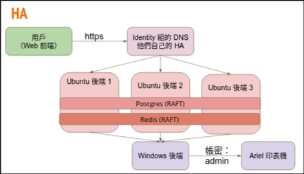

# System Design
## System Architecture Diagram and HA Schema

## Tech Stack Overview

> Frontend: React
> Backend: Python Django
> Database: PostgreSQL 15, Redis 7
> Ubuntu -> Windows Communication: grpc

## Data Flow
User session: FE -> Django BE -> Redis
Print: 
    1. FE -> Django BE -> Postgres DB (query balance)
    2. FE -> Djange BE -> Scheduler
    3. Scheduler
        - Scheduler -> Windows (print)
        - Scheduler -> Postgres DB (balance modification)

## Core Business Rules
如果列印服務有問題 scheduler 會重新嘗試三次，都失敗則會退款

## Background Workers & Scheduled Tasks
- nginx: for reverse proxy
